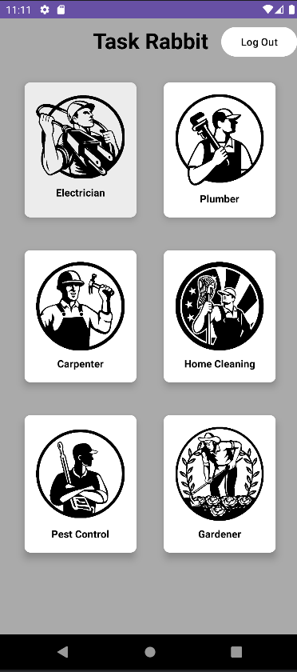
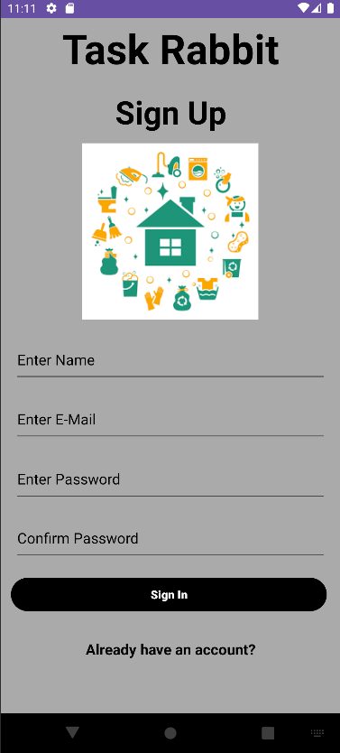
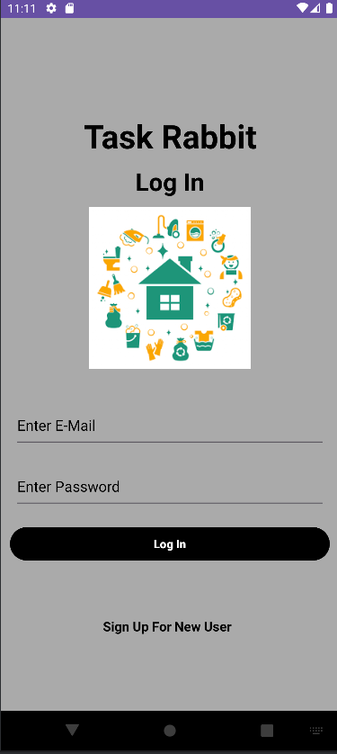
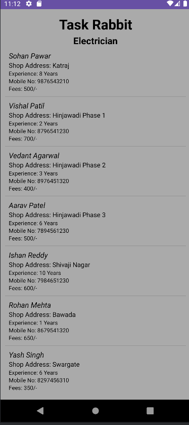
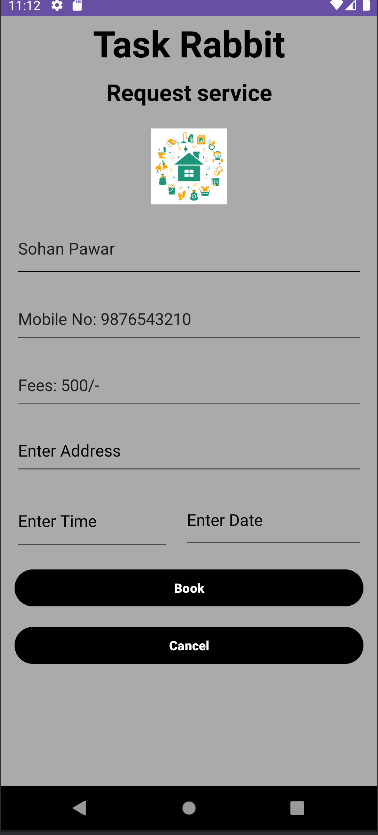
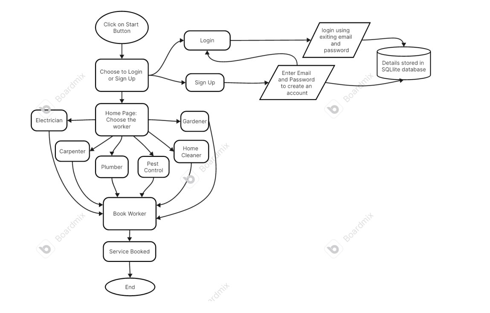

Here's a comprehensive and professional `README.md` file for the Task Rabbit project, including images and structured sections for clarity and detail.

---

# Task Rabbit: Your Service Provider App


## Introduction

Task Rabbit is an innovative mobile application designed to bridge the gap between service providers and consumers. Whether you need a plumber, electrician, or any other skilled worker, Task Rabbit simplifies the process of finding and hiring professionals in your local area.

## Project Overview

This project was conceived and developed solely by me as part of the Mobile Application Development course. It represents an innovative solution aimed at modernizing the service-providing sector by leveraging mobile technology. The app, Task Rabbit, serves as a bridge between consumers and skilled workers, offering a convenient and efficient platform for booking various services. By focusing on user experience and accessibility, Task Rabbit aims to simplify the process of finding and hiring professionals for a wide range of tasks, ultimately enhancing convenience and satisfaction for users.

## Project Idea

- Task Rabbit was born out of the need to simplify the process of finding and hiring skilled service providers. In today's fast-paced world, people often struggle to find reliable professionals for various tasks, whether it's fixing a leaky faucet, installing electrical fixtures, or painting a room. Traditional methods of searching for service providers can be time-consuming and inefficient.
- The idea behind Task Rabbit is to leverage mobile technology to create a platform that connects users with skilled workers in their local area quickly and easily. By centralizing service listings, streamlining the booking process, and providing user-friendly features, Task Rabbit aims to revolutionize the way people access services.
- Our vision for Task Rabbit goes beyond just convenience; we believe that by making it easier for people to find and hire skilled workers, we can empower individuals to focus on what matters most to them. Whether it's spending time with family, pursuing hobbies, or growing their business, Task Rabbit aims to free up valuable time and resources for users, ultimately improving their quality of life.
- With Task Rabbit, we envision a future where finding reliable service providers is no longer a hassle but a seamless and enjoyable experience. We're committed to continuously improving and expanding the platform to fulfill this vision and make a positive impact on the lives of our users.

## Table of Contents

- [Introduction](#introduction)
- [Project Overview](#project-overview)
- [Features](#features)
- [Installation](#installation)
- [Usage](#usage)
- [Methodology](#methodology)
- [Roadmap](#roadmap)
- [Support](#support)
- [Contact-Us](#contact-us)
- [License](#license)

## Features

- **User Profiles:** Each service worker’s profile includes essential details such as skills, experience, fees, and contact information.
- **Easy Booking:** Users can schedule appointments directly through the app, selecting convenient time slots.
- **Secure Data Storage:** The app uses an SQL database to securely store user login data.
- **Wide Variety of Services:** Users have access to a wide range of service providers in their desired location.
- **Real-Time Notifications:** Users receive toaster notifications confirming successful bookings.



## Installation

To install and run Task Rabbit on your local machine, follow these steps:

1. **Clone the repository:**
   ```bash
   git clone https://github.com/OM-HASE/Task-Rabbit.git
   ```

2. **Navigate to the project directory:**
   ```bash
   cd Task-Rabbit
   ```

3. **Open the project in Android Studio:**
   - Launch Android Studio.
   - Select "Open an existing Android Studio project."
   - Navigate to the `Task-Rabbit` directory and select it.

4. **Build the project:**
   - Ensure all dependencies are installed.
   - Build the project using Android Studio.

5. **Run the app:**
   - Connect an Android device or use an emulator.
   - Run the app from Android Studio.

## Usage

1. **Sign Up:**
   - Enter your name, email, and password to create an account.
   - Your credentials will be securely stored in the SQL database.
     
   

2. **Log In:**
   - Use your registered email and password to log in to the app.
     
   

3. **Browse Services:**
   - Choose from various service categories such as plumbing, electrical, and more.
   - View profiles of available service workers in your area.
     
   

4. **Book a Service:**
   - Select a service worker and choose a convenient time slot.
   - Confirm your booking and receive a notification.
  
   
   

## Methodology

- **User Authentication:** Users enter their email and password to sign in, which is saved into an SQL database.
- **Service Selection:** Users can choose from six types of workers and view a list of available professionals in their area.
- **Booking Confirmation:** A toaster notification confirms successful bookings, and users are redirected to the home page.



## Roadmap

- Stay tuned for upcoming updates and features! We're continuously working to enhance Task Rabbit and provide a better experience for our users. Here's a sneak peek at some of the features we're planning to implement in future releases:
- Integration with third-party payment gateways for seamless transactions.
Enhanced search functionality to help users find services more efficiently.
Implementing a rating and review system for service providers to build trust and credibility.
We value your feedback and suggestions as we shape the future of Task Rabbit. Keep an eye on our GitHub repository for announcements and updates.

## Support

If you encounter any issues while using Task Rabbit or have any questions, feel free to reach out for support. You can contact us via email at omhase9955@gmail.com or open an issue on GitHub. Our team is here to assist you and address any concerns you may have.

## Contact-Us

Have feedback, suggestions, or questions? We'd love to hear from you! You can reach out to us via email, social media, or through our website. Your feedback helps us improve Task Rabbit and provide a better experience for all users.

- Email: omhase9955@gmail.com
- LinkedIn: www.linkedin.com/in/omhase

## License

This project is licensed under the MIT License. See the [LICENSE](LICENSE) file for details.
