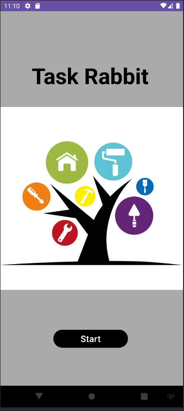
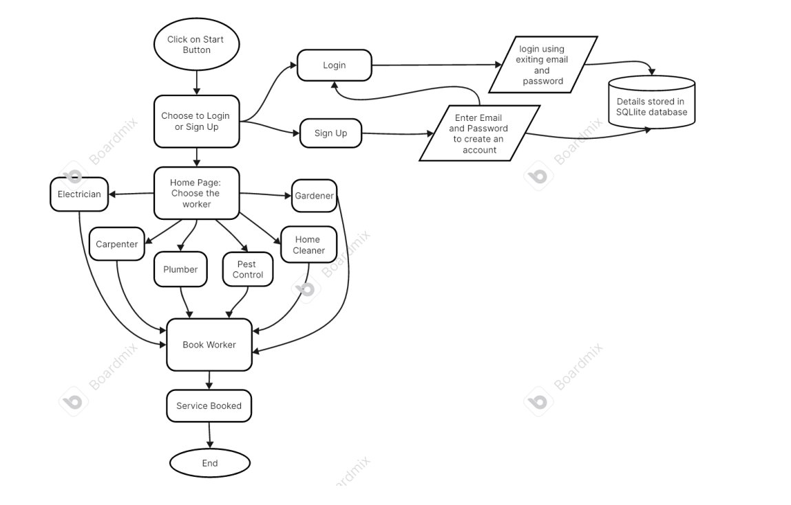

Here's a comprehensive and professional `README.md` file for the Task Rabbit project, including images and structured sections for clarity and detail.

---

# Task Rabbit: Your Service Provider App


## Introduction

Task Rabbit is an innovative mobile application designed to bridge the gap between service providers and consumers. Whether you need a plumber, electrician, or any other skilled worker, Task Rabbit simplifies the process of finding and hiring professionals in your local area.

## Project Overview

This project was conceived and developed solely by me as part of the Mobile Application Development course. It represents an innovative solution aimed at modernizing the service-providing sector by leveraging mobile technology. The app, Task Rabbit, serves as a bridge between consumers and skilled workers, offering a convenient and efficient platform for booking various services. By focusing on user experience and accessibility, Task Rabbit aims to simplify the process of finding and hiring professionals for a wide range of tasks, ultimately enhancing convenience and satisfaction for users.

## Table of Contents

- [Introduction](#introduction)
- [Project Overview](#project-overview)
- [Features](#features)
- [Installation](#installation)
- [Usage](#usage)
- [Methodology](#methodology)
- [Acknowledgements](#acknowledgements)
- [License](#license)

## Features

- **User Profiles:** Each service worker’s profile includes essential details such as skills, experience, fees, and contact information.
- **Easy Booking:** Users can schedule appointments directly through the app, selecting convenient time slots.
- **Secure Data Storage:** The app uses an SQL database to securely store user login data.
- **Wide Variety of Services:** Users have access to a wide range of service providers in their desired location.
- **Real-Time Notifications:** Users receive toaster notifications confirming successful bookings.



## Installation

To install and run Task Rabbit on your local machine, follow these steps:

1. **Clone the repository:**
   ```bash
   git clone https://github.com/OM-HASE/Task-Rabbit.git
   ```

2. **Navigate to the project directory:**
   ```bash
   cd Task-Rabbit
   ```

3. **Open the project in Android Studio:**
   - Launch Android Studio.
   - Select "Open an existing Android Studio project."
   - Navigate to the `Task-Rabbit` directory and select it.

4. **Build the project:**
   - Ensure all dependencies are installed.
   - Build the project using Android Studio.

5. **Run the app:**
   - Connect an Android device or use an emulator.
   - Run the app from Android Studio.

## Usage

1. **Sign Up:**
   - Enter your name, email, and password to create an account.
   - Your credentials will be securely stored in the SQL database.

2. **Log In:**
   - Use your registered email and password to log in to the app.

3. **Browse Services:**
   - Choose from various service categories such as plumbing, electrical, and more.
   - View profiles of available service workers in your area.

4. **Book a Service:**
   - Select a service worker and choose a convenient time slot.
   - Confirm your booking and receive a notification.

5. **Manage Bookings:**
   - View and manage your upcoming and past bookings from your profile.

## Methodology

- **User Authentication:** Users enter their email and password to sign in, which is saved into an SQL database.
- **Service Selection:** Users can choose from six types of workers and view a list of available professionals in their area.
- **Booking Confirmation:** A toaster notification confirms successful bookings, and users are redirected to the home page.



## Acknowledgements

We extend our heartfelt gratitude to Prof. Amruta Bhawarthi for her invaluable guidance and support throughout the development of Task Rabbit. Her expertise and dedication were crucial in bringing our project to fruition.

## License

This project is licensed under the MIT License. See the [LICENSE](LICENSE) file for details.
